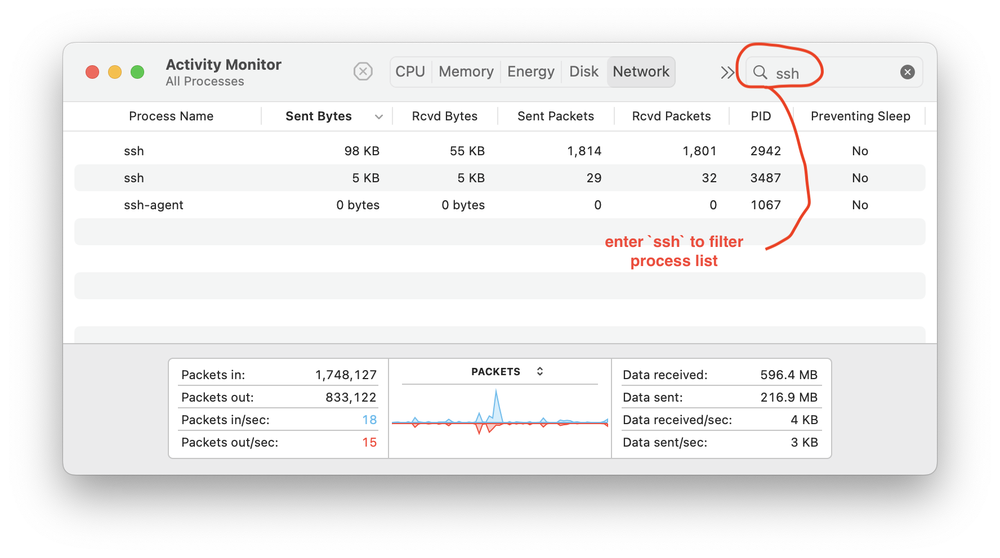

## "client_loop: send disconnect: Broken pipe"

### (or, How to stop MacOS from dropping SSH connections)

Irritating, no? If your SSH connections are [*dropping like flies*](https://idioms.thefreedictionary.com/drop+like+flies), you can stop that - at least under some circumstances. The following approach will maintain viable SSH connections (and other network connections and processes) for hours, days, weeks, etc... even when the lid on your MacBook is closed. Here's how:

```zsh
% man caffeinate    # Read it! Don't worry - it's Apple docs, so it's skimpy 
% 
% caffeinate -s ssh userid@host # prevent system sleep while this ssh instance is alive
```

* `caffeinate -s` :   Create an assertion to prevent the system from sleeping - valid only when system is running on AC power (*i.e.* your charger is connected). 
* `caffeinate -i` :   Alternatively, this assertion ***removes*** the restriction that the system is running on AC power; i.e. also prevents sleep when system is running from battery. 

This command tells macOS that it should **not sleep** while the process which follows (an `ssh` connection in this case) is running. Sleep mode stops most network activity, so it should be avoided to maintain our network connections. 

Using this method, when your Mac is running from mains power (charger), your SSH connection will remain viable even after the lid is closed for hours, days, etc. No 3rd party software is required for this method, and it has been verified to work on the following MacBook Pros:

- 2023, 16-inch MacBook Pro, Ventura
- 2019, 16-inch MacBook Pro, Catalina
- 2016, 15-inch MacBook Pro, Mojave
- Late 2011, 17-inch MacBook Pro, High Sierra 

It may work on other models also; please share feedback if you try it. Once again, you should have your MacBook connected to the charger for extended sessions. Running on battery power alone, at some point the system will override `caffeinate`. 

### Some Caveats and Details:

There are a few caveats... `caffeinate [-s, -i] ssh user@host` works - but it remains subject to unknowns in Apple's proprietary software. My experience has been that the **most reliable** connection is realized on late-model Macbooks with a healthy battery. Older model Macs include an app called `Energy Saver` that includes various settings (including something called `Power Nap`), and Batteries eventually reach a point where they are flagged as `Service Recommended`. I do not know how these variables affect `caffeinate`. 

There are also variables in the `ssh` protocol that can affect connection reliability; some controlled by the server - others controlled by the client. SSH *"keep-alive"* messages may be configured in the **SSH server** (which you may or may not have control over), **or** they may be configured in the **SSH client** (which presumably you do have control over). SSH connection reliability may be improved if the client or server (or both) are configured to send *"keep-alives"*. You can apply these options on the command line on a per-connection basis, or set this up for all connections by placing them in your `~/.ssh/config` file as follows: 

```zsh
Host *
    ServerAliveInterval 60
    ServerAliveCountMax 10
# Note: There may be other items in ~/.ssh/config
#
# On a per-connection basis: 
% ssh -o ServerAliveInterval=60 -o ServerAliveCountMax=10 pi@raspberrypi4b
```

The `ssh` options `ServerAliveInterval` & `ServerAliveCountMax` instruct your `ssh` client to send *"keep-alive"* messages to the server at 60 second intervals, and not to *"give up"* until 10 messages go un-answered. These values (60, 10) are not hard-and-fast settings, but merely guides - feel free to  change them if you're so inclined. 

***The Bottom Line:*** In my experience, using the "keep-alive" options can make an improvement in connection reliability on older-model Macbooks - even when used with `caffeinate`. This may have something to do with the status of the older batteries - or it may be due to changes Apple has made to their proprietary software. I solicit reader feedback on this.

Let's start a couple of SSH connections, and look at the `Activity Monitor` app to see what it can show us:

```zsh
% caffeinate -s ssh -o ServerAliveInterval=60 -o ServerAliveCountMax=10 pi@raspberrypi4b
# and in a second terminal window:
% caffeinate -s ssh pi@raspberrypi3b
# the *4b & *3b hosts are identically configured, but are different machines
```

We start `Activity Monitor` app, select the `Network` tab, add the `Preventing Sleep` column to the display, close the lid on the 2023 Macbook Pro (Ventura), and let it run for approximately 30 hours. Re-opening the lid, we are greeted with this in `Activity Monitor`: 



We see both `ssh` sessions, indicating they are both still "alive", and we note that one of them has considerably more Sent & Rcvd packets than the other. From this we deduce that the first one (PID 2942) is the connection to the **\*4b** host using the *keep-alives*. You may also not that neither of the SSH sessions are indicated to be `Preventing Sleep`; it is the `caffeinate` process that is preventing sleep. 


---

#### Miscellany:

Apple has removed the `Energy Saver` app from Macbooks, replacing it with the `Battery` app since Big Sur.  For now at least, I'll opine that `Battery` is an improvement. I never found `Energy Saver`, nor its CLI `pmset` useful. And they're certainly not well-documented - a failing that makes them worse than useless IMHO. Consequently, I'll recommend you not bother with the myriad suggestions posted on the Internet that counsel making changes to your Mac's Power Management settings with the `pmset` command-line utility, or `Energy Saver`.  `pmset` has some interesting features, but Apple has provided only [*sparse*](https://idioms.thefreedictionary.com/piss-poor) documentation in a `man pmset` that's not been updated since 2012. After repeated failed attempts to find any Apple-sourced documentation for `pmset` on Apple's websites, I've been forced to conclude Apple has simply chosen not to disclose how `pmset` works. I feel that using `pmset` is unreliable at best, risky at worst. 

---

### REFERENCES:

* [airport – the Little Known Command Line Wireless Utility for Mac](https://osxdaily.com/2007/01/18/airport-the-little-known-command-line-wireless-utility/) - from OSX Daily.
* [macOS Networking Articles](https://osxdaily.com/tag/networking/) - from OSX Daily.
* [macOS WiFi Articles](https://osxdaily.com/tag/wi-fi/) - from OSX Daily. 
* [Q&A: What causes Raspberry Pi to reliably drop SSH connections: `client_loop: send disconnect: Broken pipe`](https://raspberrypi.stackexchange.com/questions/111265/what-causes-raspberry-pi-to-reliably-drop-ssh-connections-client-loop-send-di) 
* [Debian's `sshd_config` - OpenSSH SSH daemon configuration file](https://manpages.debian.org/buster/openssh-server/sshd_config.5.en.html) 
* [Q&A: What is the default idle timeout for OpenSSH?](https://unix.stackexchange.com/questions/150402/what-is-the-default-idle-timeout-for-openssh) - Useful!!
* [Q&A: How does an SSH connection become inactive?](https://unix.stackexchange.com/questions/263302/how-does-an-ssh-connection-become-inactive) - less useful... 
* [Proper use of SSH client in Mac OS X](https://www.getpagespeed.com/work/proper-use-of-ssh-client-in-mac-os-x) 
