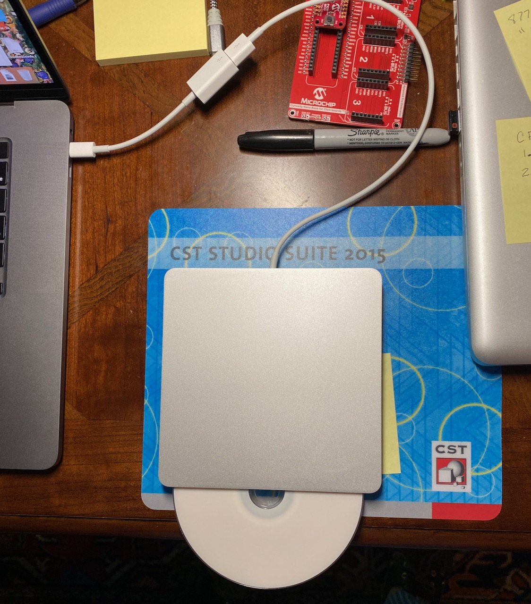

# Eclectic Tips & Tricks for Mac OS

#### Table of contents

[1. How to Change Where Screenshots Are Saved?](#1-how-to-change-where-screenshots-are-saved) 

[1.5 A zsh Script to Re-Name Your Screenshots](#15-a-shell-script-to-rename-screenshot-files)  

[2. How to Prevent macOS From Sleeping?](#2-how-to-prevent-macos-from-sleeping)

[3. How to Start (`open`) an App From the macOS Command Line?](#3-how-to-start-open-an-app-from-the-macos-command-line) 

[3.5 How to `open` a Network drive](#35-how-to-open-a-network-share) 

[4. How to Schedule an App to Run At a Specified Time?](#4-how-to-schedule-an-app-to-run-at-a-specified-time)

[5. How to Check the Size of a Directory?](#5-how-to-check-the-size-of-a-directory)

[6. How to Check Battery Status from the Command Line?](#6-how-to-check-battery-status-from-the-command-line)

[7. How to Send Files to the Trash from the macos Command Line?](#7-how-to-send-files-to-the-trash-from-the-macos-command-line)

[8. How to Find the Hardware Architecture and OS Version for My Mac?](#8-how-to-find-the-hardware-architecture-and-os-version-for-my-mac)

[9. How to Combine/Concatenate Multiple PDFs?](#9-how-to-combineconcatenate-multiple-pdfs)

[10. How to Search My Command History in `Terminal`?](#10-how-to-search-my-command-history-in-terminal)

[11. How to Disable Auto-Booting When Opening the Macbook Lid?](#11-how-to-disable-auto-booting-when-opening-the-macbook-lid)

[12. How to Copy `command line` Output to Pasteboard/Clipboard?](#12-how-to-copy-command-line-output-to-pasteboardclipboard)

[14. How to Show Hidden Files in Finder?](#14-how-to-show-hidden-files-in-finder)

[15. How to Recover a Bodged `git` Repository?](#15-how-to-recover-a-bodged-git-repository) 

[16. How to Restore the "Lost Startup Chime"?](#16-how-to-restore-the-lost-startup-chime) 

[17. Weird Behavior With zsh; `noglob` and `rm -rf`](#17-weird-behavior-with-zsh-noglob-and-rm-is-reluctant) 

[18. How to Hide All Open Windows on a Desktop? ('Show Desktop')](#18-how-to-hide-all-open-windows-on-a-desktop-show-desktop) 

[19. How to Set Default Editor for CLI/Terminal App](#19-how-to-set-default-editor-for-cliterminal-app) 

[20. How to See Your Environment Variables](#20-how-to-see-your-environment-variables) 

[21. Where is the PATH Environment Variable Stored on MacOS?](#21-where-is-the-path-environment-variable-stored-on-macos) 

[22. How to Enable `cron` in macOS](#22-how-to-enable-cron-on-current-versions-of-macos)

[23. Getting Up to Speed on `zsh`](#23-getting-up-to-speed-on-zsh) 

[24. Upgrade Xcode on High Sierra... or Why Does Apple Crap On Us?](#24-upgrade-xcode-on-high-sierra-or-why-does-apple-crap-on-us)

[25. Cleaning and Restoration of iTerm2](#25-cleaning-and-restoration-of-iterm2)  

[26. "client_loop: send disconnect: Broken pipe"](#26-client_loop-send-disconnect-broken-pipe)

[27. Re-Installing macOS](#27-potentially-useful-info-for-re-Installing-macos)

[28. Tools for Isolating Hardware Faults in Macs](#28-tools-for-isolating-hardware-faults-in-macs)

[29. Insert Symbols in macOS](#29-insert-symbols-in-macos)

[30. The Elusive Symbol for Degree°](#30-the-elusive-symbol-for-degree)

[31. The Strange Case of `airport`](#31-the-strange-case-of-airport) 

[32. Do You Want to Move That File, or Copy It?](#32-would-you-like-to-move-that-file-or-copy-it) 

[33. Should You Put Siri on an "iLeash", or Put Her Down?](#33-should-you-put-siri-on-an-ileash-or-put-her-down) 

[34. Burning ISO files to DVD Using `hdiutil`](#34-burning-iso-files-to-dvd) 

[35. Switch the Profile in your current Terminal window](#35-switch-the-profile-in-your-current-terminal-window) 

[36. Stop Apple's Updates from trashing your customized `/etc` files](#36-stop-apples-updates-from-trashing-your-customized-etc-files) 

[37. Don't fret over loss of `youtube-dl`](#37-dont-fret-over-loss-of-youtube-dl) 

[38. Add "QuickLook" visibility for `.webp` images in older Macs](#38-add-webp-quicklook-for-older-macs) - **UPDATED** *20240823*

[39. Apple sucks again](#39-whereis-vs-which-and-why-Apple-sucks) 

[40. Refresh shell configuration without restarting](#40-refresh-shell-configuration-without-restarting) 

[41. Why not upgrade macOS?](#41-why-i-do-not-upgrade-macos)

[OTHER SOURCES:](#other-sources) 

<hr>


### 1. How to Change Where Screenshots Are Saved?

Two lines of input are needed at the command line; regular user privileges are sufficient. The first changes the default location, the second restarts the __SystemUIServer__ 

```
     $ defaults write com.apple.screencapture location ~/Desktop/screenshots
     $ killall SystemUIServer
```

Alternatively, you may specify the full path: 

```
     $ defaults write com.apple.screencapture location Home/yourusername/Desktop/screenshots
     $ killall SystemUIServer
```

This will cause all screenshots to be saved in a folder called `screenshots` on your Desktop. You may, of course, store them anywhere you wish*. 

\* Note that you must create this folder if it doesn't already exist!  [↑toc](#table-of-contents) 

### 1.5 A Shell Script to Rename Screenshot Files

Apple does several things I don't particularly like. One of them is the file-naming convention they dictate for screenshots. Somewhere in the abyss of configuration files, there is probably a prescription for that, but finding Apple's documentation is never easy - even if it exists. For example, there is a shell command named `screencapture` - it even has a system manual at `man screencapture`! If you read to the bottom, you'll find a couple of interesting items:  

   1. > BUGS - Better documentation is needed for this utility. 

   2. >June 16, 2004

So - ***someone*** at Apple recognized their documentation sucks, yet the document was last updated in mid-2004! 

But we're not here to belabor the poor state of Apple's documentation. Here's a script that will do a *bulk-rename* of all the files in your screenshots (or any other) folder: 

```zsh
#!/bin/zsh
# shotfnmv.sh
cd $HOME/TestShots
for afile in *.png
do
   echo $afile
   oldfile=$(basename "$afile")
   echo $oldfile
   if [[ $oldfile == *"Screen Shot"* ]]; then
     echo "Found an Apple-formatted Screen Shot file."

     oldtimestr=$(echo "$oldfile" | awk '{ printf "%s-%s_%s\n", $3, $5, substr($6,1,2) }')
     echo $oldtimestr
     newtimestr=$(date -j -f %Y-%m-%d-%I.%M.%S_%p "$oldtimestr" "+%Y-%m-%d-%T")
     echo $newtimestr
     newfile="screenshot-${newtimestr}.png"
     echo $newfile
#    mv "$oldfile" "$newfile"                   # overwrite fienames in place
     cp -np "$oldfile" "$newfile"               # copy file to same dir, new name
#    cp -np "$oldfile" ../TestShots2/"$newfile" # copy file to different dir, new name
  fi
done
```

The `shebang` calls for `zsh`, but I believe the script will run in `bash`, and perhaps other shells. The `date` and `awk` utilities are the "native Apple" versions in `/bin` & `/usr/bin`. I've tested the script on my MBP macOS 10.15.6, and it seems to work fine for me. Note there are two.`#/comments` near the end that give you the option to copy or overwrite the original files. Also, the script still contains `echo` commands inserted for debugging - which can of course be *commented out* to reduce the noise. While I have tested this, I urge caution because Apple is free to change their file-naming format without notice, and it's not been rigorously tested against a wide variety of filenames. The latest version of the script is available in the [./src folder here](https://github.com/seamusdemora/seamusdemora.github.io/blob/master/src/shotfnmv.sh). 

Beyond that, a few other points worth mention: 

* The string `Screen Shot` is used as a filter to select only Apple-named screenshots; this will exclude files with, for example,  `Screen Recording` in the filename - or any files you have saved in the folder with any name that doesn't begin with `Screen Shot`. 
* `awk` is used to parse the filename into fields, and extract the original date-time string from the original file name. This original-format date-time string is saved in the shell variable `oldtimestr`
* `date` is used to re-format `oldtimestr` into a cleaner (IMO) format in `newtimestr`; i.e. they are the *same date & time, but in a different format*.
* After that it's only a matter of copying (`cp`) the new file to retain both `oldfile` & `newfile`, or overwriting (`mv`) the `oldfile` with `newfile`. 

[↑](#table-of-contents)

### 2. How to Prevent macOS From Sleeping?

Caffeine may do the trick; specifically `caffeinate` may be exactly what you need for your Mac. Know first that `man caffeinate` is your friend; enter it at the command line, and you'll find all the documentation for using this utility. `caffeinate` creates assertions to alter system sleep behavior. Following are a couple of general use cases: 

```
    $ caffeinate -s  
```

or perhaps more effectively as follows: 

```
    $ caffeinate -s &
    [1] 1558         (IF YOU WISH TO RESTORE THE SLEEP PATTERN AFTER SOME TIME, simply kill it as follows: )
    $ kill 1558
```

Used in this way, `caffeinate` is a ***blunt instrument***. This command simply creates and holds an assertion that will prevent the Mac from sleeping<sup id="a1">[Note1](#f1)</sup> as long as it remains on ac/mains power. Run in the background, you can continue the terminal session for as long as needed, and then simply kill `caffeinate`'s PID to release the assertion and restore sleep patterns. 

```
    $ caffeinate -w PID
```

When used with the `-w` argument, sleep will be inhibited as long as the process ID `PID` is active. Once the the process exits, the assertion is released, and the configured sleep behavior will resume when appropriate. 

Note also that Process ID's are available from `Activity Monitor`, or can be listed in the terminal by entering `ps -Al` 

​    <b id="f1">Note1:</b> *Know that `caffeinate` will not prevent a scheduled [automatic logout](http://osxdaily.com/2013/03/23/automatically-log-out-of-a-mac-after-a-period-of-inactivity/)*. 

[↑toc](#table-of-contents) 

### 3. How to Start (`open`) an App From the macOS Command Line?

There may be occasions when you want or need to start an application from the command line. Or perhaps start an app from a script, or even to start the app at a specified time (more on scheduling in the sequel), or on an interrupt-driven basis triggered by an event. The `open` utility (ref. `man open`) is designed for this. For example, you want to start Chrome to check your Gmail account - how would you do this? Here's one way: 

a. get the location of the app

```
$ ls -d -1 /Applications/*.* | grep Chrome  
/Applications/Google Chrome.app  
```

b. get the URL for your Gmail inbox:  

```
https://mail.google.com/mail/u/0/#inbox  
```

c. use `open` to start Chrome and load GMail: 

```
$ open -a "/Applications/Google Chrome.app" https://mail.google.com/mail/u/0/#inbox
```

>         *Note that the file specification must be inside quotes to "protect" the space in the app name.* 

d. `open` also has some options specific to text editing; for example to open a `man` page with your system's default text editor. Here, we'll open the man page for `open` in the default text editor :  

```
$ man open | col -b | open -tf  
```

Which can be quite useful for perusing the system documentation offline (in this example, the `man` page for `open`), and/or making additions or changes to it either for your own use, or to share.   

[↑](#table-of-contents)  

### 3.5 How to `open` a Network share

`open` can also launch Finder, and open a network share: 

a. Open `Finder`, click the `Go` item in the Menu, and then `Connect to server...` (or ,<kbd>⌘</kbd><kbd>K</kbd>)

b. Enter `smb://server/share`, and click the `Connect` button, **OR** click `Browse` to select a server & share.

c. A new `Finder` window/tab will open showing the contents of`smb://server/share`. That connection is now _registered_ in the `LaunchServices` database, and entering `open smb://server/share` in `Terminal.app`will open to that share in `Finder`. 

Note: This will also work for any other supported network file system: `cifs`, `nfs`, etc.  

[↑](#table-of-contents) 

### 4. How to Schedule an App to Run At a Specified Time?

In current versions of mac os, there are (at least) three distinct approaches to scheduling:   

1. `cron` is the standard (as in long-standing) method for scheduling. It's been around since the early days of Unix. That `cron` remains as a viable, well-maintained app today is a testament to its utility. And as a derivative of the BSD flavor of Unix, it is fitting that it remains a component of mac os. However, we must note that Apple has not maintained the `cron` software they distribute with mac os; `man cron`  reveals that the current version os `cron` in mac os ver 10.14.6 (Mojave) is vintage **June 17, 2007**. See the example below.

2. `launchd` is a much more complicated creature than `cron`, but it's got an Apple pedigree. It was developed by Dave Zarzycki, an Apple employee who started with them in 1996 as a 17 year-old, self-taught programmer.  `launchd` can do more than `cron`, but it's much more difficult (even arcane) in use. Consequently, we'll cover `cron` here, and pick up `launchd` in [this installment](UsingLaunchdForSchedulingTasks.md). 

3. `at` is a bit of an outlier in the sense it's less frequently used. As of macOS Catalina, `at` is still included, and supported (in the fashion that Apple supports such things). If you're interested, read two things: `man at` and this Q&A on Stack Exchange: [Making “at” work on macOS](https://unix.stackexchange.com/questions/478823/making-at-work-on-macos) that explains how to work around the debris known as Apple's "open source" environment. N.B. that Apple's version of `at` isn't as up-to-date as the one in your favorite Linux distro, but it does work as shown in the following example: 

   **`at` Example:**
   
   ```zsh
   % at now + 1 minute
   <enter this sh command:> echo "Hello World from at"
   <enter ^D>
   job 9 at Wed Oct  7 03:17:00 2020 
   % at -l
   9	Wed Oct  6 13:17:00 2020
   %
   ```

      ​            So... now what? Where's the output? Does this `at` thing work at all? 
   
      ​            Yes, it created the requested output... it's in an email message! You can verify this by checking your email with the `mail` command. Alternatively, you may use a `redirect` to send the output to a file; e.g. `echo "Hello World from at" > ~/at_output.txt`

   **`cron` Example:**

   Let's assume, you want to check your Gmail account each day at 12:00. How would you do this? Here's one way to do this using `open` and `cron` : 

   `cron` events are declared and scheduled in the `crontab`. They follow a specific syntax, although there are variations across the different versions of `cron`. We're working of course with Mac OS, and that means the Vixie (named after Paul VIxie) version of `cron`.  Creating an entry in your `crontab` file is done with a simple command: 

   ```bash
   crontab -e
   ```

   If this is the first time you've edited your `crontab`, you'll probably find the editor opens a completely blank file. Many Linux systems will have a default `crontab` that has comments and helpful hints, but Mac OS does not. 
   
   Let's schedule our event now. Enter the following line in the `nano` editor you've just opened: 

   ```
   00 12 * * * open -a "/Applications/Google Chrome.app" https://mail.google.com/mail/u/0/#inbox
   ```

   Next, tell `nano` to write your new `crontab` by entering `ctrl-o`, `enter` to accept the filename, and `ctrl-x` to exit `nano`. And that's it. You've just scheduled Chrome to start and fetch your Gmail inbox every day at 12:00 noon.  
   
   You'll recognize the `open` command and the parameters that follow it in the `crontab` entry. We've prepended a strange-looking sequence to that: 

   ```
   00 12 * * *
   ```

   This is simply the schedule information. It tells `cron` **when** to execute the command that follows. If you want to re-schedule for a time other that 12:00 noon, all you need change is the time. `man crontab` will guide you in the options for specifying the time and date. Until you become familiar with the syntax, you should use the [crontab guru](https://crontab.guru/#00_12_*_*_*) to check your schedule. You'll learn that  [`cron`'s simple syntax is quite flexible](https://crontab.guru/#5_4-7_1-28/2_1-9/3_*).    
   
   [↑](#table-of-contents)

### 5. How to Check the Size of a Directory?

You can of course do this from the Finder menu: `File, Get Info`, but it may be quicker from the command line.

For a directory on your Mac's HDD: 
```
$ du -sh /path/to/directory
```
For a network drive that's mounted: 
```
$ du -sh /Volumes/sharename/path/to/directory  
```

[↑](#table-of-contents)

### 6. How to Check Battery Status from the Command Line?

The `pmset` utility provides a host of information, and allows manipulation of ***power management settings*** from the command line. For example, to get battery status: 

```bash
$ pmset -g batt                        # and for example, my Mac now reports" 
Now drawing from 'AC Power'
 -InternalBattery-0 (id=1234567)	100%; charged; 0:00 remaining present: true
```

The `-g`  (get) option provides data on current settings and logfiles. It can be run with normal user privileges. `pmset`can also change settings (e.g. standby, sleep, spin-down of disks, display, etc.), but those require `root`/`su` privileges. Documentation is available from `man pmset`.    

[↑](#table-of-contents)

### 7. How to Send Files to the Trash from the macos Command Line?

This is easily and elegntly done thanks to the work of dabrahams. The latest version of the command line utility named `trash` is [available in this gist on GitHub](https://gist.github.com/dabrahams/14fedc316441c350b382528ea64bc09c), and [now here in this repo](https://github.com/seamusdemora/seamusdemora.github.io/blob/master/Trash.md). Its creation was spawned by a Q&A on Stack Exchange, and initially posted in [this answer](https://apple.stackexchange.com/a/162354). There is always `rm` of course, but it's a permanent and irrecoverable deletion. What makes `trash` special is that it ***moves*** files to the `Trash` folder, essentially replicating the system's `Move to Trash` feature available in `Finder`. And from `Trash` of course you have the option to recover the file, or delete it permanently. 

It's written in Python, and *open source*. If you want to "integrate" `trash` into your system: 

- Save the script as a file named `trash`, and copy `trash` to `/usr/local/bin` 

- ```
  $ chmod a+rx /usr/local/bin/trash
  ```

[↑](#table-of-contents)

### 8. How to Find the Hardware Architecture and OS Version for My Mac?

Because `macos` has (some of) its roots in BSD Unix rather than Linux, the `machine` command will reveal hardware: 

```bash
$ machine
x86_64h                         # on a new-ish machine
```

And if you want to see perhaps the *shortest man page in the entire world*, check out `man machine`.  :) 

However, the following *Linux-style* command also works: 

```bash
$ uname -m
x86_64
```

`uname` has several other options, all described in `man uname`. 

And finally, suggest that you *do not* use this: 

```bash
$ arch
i386
```

This is of course an **incorrect answer** for 64-bit processors, but one that you will get as of today (Mojave 10.14.4)**!** [Some have suggested](https://unix.stackexchange.com/a/518320/286615) that the `i386` output simply means that it's *capable* of running 32-bit programs. However, `man arch` makes no such statement. Consequently, it's my opinion that Apple has simply dropped the ball! In any case, the information is virtually useless. 

To get the version of the OS: 

```bash
$ sw_vers
ProductName:	Mac OS X
ProductVersion:	10.14.4
BuildVersion:	18E226
```

Note however, there is more confusion/inconsistency between the `sw_vers` command, and `uname -r[sv]`: both commands claim to display the `OS version`, but `uname -r[sv]` actually gives the version of its kernel (currently named [`Darwin`](https://en.wikipedia.org/wiki/Darwin_%28operating_system%29)): 
```bash
$ uname -v
Darwin Kernel Version 18.5.0: Mon Mar 11 20:40:32 PDT 2019; root:xnu-4903.251.3~3/RELEASE_X86_64
```

This information is also available from Apple's *unique-to-the-Mac* command line utility `system_profiler SPSoftwareDataType`. Its output shows `System Version`, which corresponds to `OS version` given by `sw_vers`, and `Kernel Version` which corresponds to `OS version` given by `uname -r[sv]`. And yes, you're correct… this ***is*** a bit of a mess!  

```
$ system_profiler SPSoftwareDataType
Software:

    System Software Overview:

      System Version: macOS 10.14.4 (18E226)
      Kernel Version: Darwin 18.5.0
      Boot Volume: Macintosh HD
      Boot Mode: Normal
```

[↑](#table-of-contents)

### 9. How to Combine/Concatenate Multiple PDFs?

[Apple has this one covered](https://support.apple.com/guide/mac-help/combine-files-into-a-pdf-mchl21ac2368/mac), and it's easy if you know ***the trick***. You should also know that the `Quick Actions > Create PDF` option in `Finder` may not show up! When you move the pointer over `Quick Actions` in `Finder` you may see only the option `Customize...`. If that's the case, click `Customize...`, then tick the box next to `Create PDF`. This will add `Create PDF` as an option for `Quick Actions`.   

[↑](#table-of-contents)

### 10. How to Search My Command History in `Terminal`?

Here are some useful techniques: 

- Type <kbd>control</kbd>+<kbd>r</kbd>  at the command prompt. This brings up a *search* prompt: `(reverse-i-search):`.  Type whatever you can recall of a previously used command (e.g. `etc` ). As you type each character, the search continues. You can iterate back through all of the search results with <kbd>control</kbd>+<kbd>r</kbd>. When you've found the command you were looking for, hit the `enter` key to run it again "as-is", or make edits to the command (*use either of the left-right arrow keys*) before you run it. If you want to stop searching without running a command, type <kbd>control</kbd>+<kbd>g</kbd>. 

- You can use the `history` command! `history` outputs the entire history to `stdout`. As such, you can *filter* the history by piping it to (e.g.) `grep`: `history | grep etc`, or redirect it to a file (e.g.`history > mycmdhistory.txt`), or any other command (e.g. `history | tail -5`).

- Of course, you can still use the *up-and-down arrow keys* to step forward (or backward) through the command history, but if your command history is extensive, this will take time.    

  [↑](#table-of-contents)

### 11. How to Disable Auto-Booting When Opening the Macbook Lid?

This useful bit of wisdom was found in [this article in OSXDaily](http://osxdaily.com/2017/01/19/disable-boot-on-open-lid-macbook-pro/). You can manipulate the MacOS firmware from the command line:

```bash
sudo nvram AutoBoot=%00
```

Note that you must execute a clean shutdown to save this value. To restore the AutoBoot feature:

```bash
sudo nvram AutoBoot=%03
```

--OR--

[Restore **ALL** NVRAM settings](http://osxdaily.com/2010/11/15/reset-pram-mac/) by rebooting the MacBook while holding down the `Command+Option+P+R` keys (yes, this is a two-handed operation :) 

What other NVRAM settings are available for changing? 

```bash
nvram -p
```

will list available options... but it's very messy!   

[↑](#table-of-contents)

### 12. How to Copy `command line` Output to Pasteboard/Clipboard?

You can **copy** from `stdout` and **paste** to `stdin` using one of the several clipboards available.

```Bash
$ ls -la | pbcopy
```

You can then paste this output into a document using the `command-v` keyboard shortcut. 

Similarly, using `pbpaste` you can paste text you've copied to a file; e.g.

```bash
$ pbpaste > newfile.txt
```

See `man pbcopy` for further details.   

[↑](#table-of-contents)

### 14. How to Show Hidden Files in Finder?

There are many **hidden files and folders** in MacOS. We have to guess what Apple's motivations are for designating certain files and folders as hidden, but it seems likely this *default* configuration is to protect users from themselves. However, there are numerous situations where it's very useful to be able to see files in Finder that are hidden from our view bt default. Examples abound: 

* all the files and folders associated with MacOS' Unix underpinnings; e.g. `/usr/local/bin`, `etc`, and many more.  
* if you maintain a `git` repository on your Mac, there will be files that you will need to edit; e.g. `.gitignore`.
* all `mount`*ed* drives and shares are listed under `/Volumes`, and it is occasionally useful to see inside this *hidden folder*. 

 Fortunately, there at least two simple ways to turn visibility of hidden files and folders `ON` and `OFF`. 


 The quickest and simplest method is to use the keyboard shortcut when a Finder window is in focus: 

 <kbd>⌘</kbd><kbd>shift</kbd><kbd>.</kbd>

 You may also use the **CLI** as follows to render the hidden files as visible from within `Finder`: 

```bash
$ defaults write com.apple.finder AppleShowAllFiles TRUE 
```

If you have open Finder windows, you'll need to close them all with this command before you see the effects of this change; i.e. before Finder shows the hidden files in its listing:

```bash
$ killall Finder
```

Opening a new `Finder` window will reveal the hidden files and folders. To return to the default: 

```bash
$ defaults write com.apple.finder AppleShowAllFiles FALSE && killall Finder
```

[↑](#table-of-contents)

### 15. How to Recover a Bodged `git` Repository?

Recently, I inadvertently deleted all of my *local* GitHub repositories. In a comical sequence of poor decisions I made things worse by copying the entire repo from a backup, but it was not in sync with the repos on GitHub. Further attempts to resolve the issues only made things worse. Then it dawned on me that *this what `git` was made for!* A quick bit of research provided the answer - from the **CLI**:

```bash
$ git fetch origin 
# some output ...
$ git reset --hard origin/master
```

A few things to review beforehand! : 

* execute these commands from the local directory where you want your repo to live, 
* The `remote` repository is the origin you want (in my case, the remote repo at GitHub was my `origin`) 
* The `branch` you want to restore is the `master` branch    
* [↑](#table-of-contents)

### 16. How to Restore the "Lost Startup Chime"?

The long lost startup chime has been found by [this fellow](https://www.cultofmac.com/686749/how-to-resurrect-your-macs-startup-chime/). Here's how to get it back on your Mac: 

```bash
sudo nvram StartupMute=%00
sudo reboot		# alternatively, `Restart...` fm the System menu
# Hear the Lost Chime once again! 
# When you get tired of it: 
sudo nvram StartupMute=%01
```

[More details and *Chime Trivia* can be found here.](https://mrmacintosh.com/how-to-enable-the-mac-startup-chime-on-your-2016-macbook-pro/) 

And if you're into [*mac nostalgia*](https://duckduckgo.com/?t=ffnt&q=mac+nostalgia&ia=web) you can [get all the default macOS wallpapers in 5K!](https://512pixels.net/projects/default-mac-wallpapers-in-5k/)   

[↑](#table-of-contents)

### 17. Weird Behavior With zsh: `noglob` and `rm` is reluctant

As most of you will be aware, Apple has made the decision to change the default shell from `bash` to `zsh` in macOS Catalina. There's more to come here on `zsh`, but for now I'll include some *discoveries* I've made here. 

* `zsh` 'over-globs'! 

  This queerness took an hour from my life: 

  ```zsh
  % curl -o rpiforum.html -L https://www.raspberrypi.org/forums/viewtopic.php?p=1528736
  zsh: no matches found: https://www.raspberrypi.org/forums/viewtopic.php?p=1528736 
  
  # wtf??
  ```

  A very old [problem according to this resource](https://github.com/ohmyzsh/ohmyzsh/issues/31). Two relatively simple solutions that might ***never*** occur to you are: 

  ```zsh
  % curl -o rpiforum.html -L "https://www.raspberrypi.org/forums/viewtopic.php?p=1528736"
    % Total    % Received % Xferd  Average Speed   Time    Time     Time  Current
                                   Dload  Upload   Total   Spent    Left  Speed
  100  120k    0  120k    0     0   199k      0 --:--:-- --:--:-- --:--:--  199k
  
  # OR, A MORE PERMANENT PATCH: 
  
  % alias curl='noglob curl'
  % curl -o rpiforum.html -L https://www.raspberrypi.org/forums/viewtopic.php?p=1528736
    % Total    % Received % Xferd  Average Speed   Time    Time     Time  Current
                                   Dload  Upload   Total   Spent    Left  Speed
  100  120k    0  120k    0     0   204k      0 --:--:-- --:--:-- --:--:--  204k
  ```

* `zsh` wants to have a *"conversation"* about using `rm -rf`! 

  Irritatingly, `zsh` refuses to follow orders when the order is `rm -rf`; it insists you confirm that you really want to `rm -rf ./somefolder/*`.  In weird *'Microsoftian'* logic, you eventually learn that this is not a bug - it's a feature. How do you disable this feature?
  
  Add the following line to `~/.zshrc`: 
  
  ```bash
  setopt rmstarsilent
  ```
  

[↑](#table-of-contents)

### 18. How to Hide All Open Windows on a Desktop? ('Show Desktop')

<kbd>fn</kbd><kbd>F11</kbd> - this will *toggle* Show & Hide all app windows on a desktop.   

[↑](#table-of-contents)

### 19. How to Set Default Editor for CLI/Terminal App

If you run a command that invokes a text editor (e.g. `crontab -e`), you may find yourself in the `vi` editor. `vi` is fine once you're used to it, but proficiency in `vi`will require time and effort. If you'd prefer to avoid learning `vi`, you can easily set your default to a more user-friendly editor like `nano`: 

```bash
export EDITOR=nano
```

Enter this at the command line in `Terminal.app`. From this point forward, anytime you run `crontab -e`, your `crontab` will open in `nano` instead of `vi`. If you want to try `vi` later, simply `export EDITOR=vi`.   

Alternatively, you can modify your `zsh` or `bash` configuration file(s) from the CLI:  

`zsh`:  
```zsh
echo 'export EDITOR=nano' >> ~/.zshrc
echo 'export VISUAL="$EDITOR"' >> ~/.zshrc
```
`bash`:  
```bash
echo 'export EDITOR=nano' >> ~/.bash_profile
echo 'export VISUAL="$EDITOR"' >> ~/.bash_profile
```
Afterwards, you can `source` the config file for it to take effect immediately in all open terminal windows:  

`zsh`:  
```zsh
source ~/.zshrc
# - or -
. ~/.zshrc     # the POSIX-compliant option!
```
`bash`:  
```bash
source ~/.bash_profile
# - or -
. ~/.bash_profile     # the POSIX-compliant option!
```
[↑](#table-of-contents)

### 20. How to See Your Environment Variables

From the command prompt:

```zsh
% printenv
# or if you prefer not to clutter your terminal history:
% printenv | less
```

 [↑](#table-of-contents)

### 21. Where is the PATH Environment Variable Stored on MacOS?

The files containing the system's default PATH environment are in two places: 

* `/etc/paths` 
* Other folders are added (typically by 3rd-party application installers) in on of the files under `/etc/paths.d` 
* Typically, your PATH environment variable is further modified for your individual use in: 
  * `~/.zprofile` - if you use `zsh`, or 
  * `~/.bash_profile` for `bash` users

[↑](#table-of-contents)

### 22. How to Enable `cron` on current versions of macOS

Beginning with Catalina, Apple has *"enhanced security"* by disallowing operations that have long been allowed. `cron`is one of those. Restoring `cron`*'s* privileges requires it be granted **Full Disk Access** in **System Preferences/Settings**. Doing this using the GUI is a brief process: 

Open System Preferences/Settings app & navigate to the Privacy tab in Security & Privacy (or to `Full Disk Access` under `Privacy & Security`)

* Select the `Full Disk Access` item in the listing (or `Privacy` in the tab); this reveals a list of apps.
* Click the `+` symbol at the bottom of the list; this will yield a `Finder` window. 
* With the `Finder` window in focus, enter <kbd>command</kbd>+<kbd>shift</kbd>+<kbd>G</kbd>, and then enter `/usr/sbin` in the dialog box.  
* From the `/usr/sbin` listing in `Finder`, select the `cron` app; it should now be added to the `Full Disk Access` list; ensure `cron` is checked/enabled.

You may now proceed to populate your `crontab` with jobs, although in the later versions of macOS (e.g. Ventura) you won't find a helpful *default* crontab to help you get started.

​    [↑](#table-of-contents)

### 23. Getting Up to Speed on `zsh`

Apple has decided that the most-commonly-used shell (`bash`) should no longer be the default shell for macOS, so in Catalina they have made `zsh` the default. The motivation for this decision is, uh... interesting, I think - if this is true. Personally, I find `bash` more comfortable, but that's just my opinion. You should make up your own mind, and here's a reading shortlist to help with `zsh`: 

* From How-To Geek: [What is ZSH, and Why Should You Use It Instead of Bash?](https://www.howtogeek.com/362409/what-is-zsh-and-why-should-you-use-it-instead-of-bash/) 
* From Armin Briegel at [Scripting OS X](https://scriptingosx.com/), a series of articles: [Moving to zsh](https://scriptingosx.com/2019/06/moving-to-zsh/), also available as a [book](https://scriptingosx.com/2019/11/new-book-release-day-moving-to-zsh/). 
* From [linux today](https://www.linuxtoday.com/), a blog post on [Writing scripts for `zsh`](https://www.linuxtoday.com/blog/writing-scripts-for-zsh.html).  
* And if you want, here's how to restore `bash` as the default shell on Catalina - [an entire article on this](https://www.howtogeek.com/444596/how-to-change-the-default-shell-to-bash-in-macos-catalina/): 

```zsh
chsh -s /bin/bash
```

Finally, know that if you prefer `bash`, you're not stuck with Apple's "antique" version of `bash`; you can get the latest release through [MacPorts](https://github.com/seamusdemora/seamusdemora.github.io/blob/master/MacPorts.md).

[↑](#table-of-contents)

### 24. Upgrade Xcode on High Sierra... or Why Does Apple Crap On Us?

Apple's abject failure to maintain many of their "Open Source" tools has led me to install [**MacPorts**](https://www.macports.org). My *ancient* MacBook Pro Late 2011 runs High Sierra, and I've been reasonably happy with it - it's a lesser hassle than my new 2019 MacBook Pro w/ Catalina. Also, since this vintage Mac has a removable SSD, I can easily back out of any failures. Anyway... as I learned, before installing MacPorts I had to upgrade XCode. XCode was installed from the AppStore, so I figured it would be an easy upgrade. But in yet another demonstration of how much Apple cares for their customers, this was far from *easy*. And no - I don't want to hear any lame explanations for this from Apple's supplicants - just STFU, please. 

That said, I followed a recipe I found here [REF @cerniuk's post](https://forums.developer.apple.com/thread/110227) for uninstalling Xcode, and it seems to work. I'm sharing it here w/ one minor addition in hope that it'll help someone else: Here's what I did: 

Remove the following: 

1. /Applications/Xcode.app
2. ~/Library/Caches/com.apple.dt.Xcode
3. ~/Library/Developer
4. ~/Library/MobileDevice
5. ~/Library/Preferences/com.apple.dt.Xcode.plist 
6. ~/Library/Preferences/com.apple.dt.xcodebuild.plist
7. /Library/Preferences/com.apple.dt.Xcode.plist
8. /System/Library/Receipts/com.apple.pkg.XcodeExtensionSupport.bom
9. /System/Library/Receipts/com.apple.pkg.XcodeExtensionSupport.plist
10. /System/Library/Receipts/com.apple.pkg.XcodeSystemResources.bom
11. /System/Library/Receipts/com.apple.pkg.XcodeSystemResources.plist 

Installing an older version of XCode is a bit different - you can't get it from the AppStore. Fortunately, [MacPorts keeps a list of downloads](https://www.macports.org/install.php), and a decent set of instructions. Once that task is accomplished, you have an *upgraded* XCode install that supports MacPorts (at least until Apple decides to break things again). 

Oh, one other thing... checking your version of XCode Tools is reasonably straightforward, but try to find the version of XCode Command Line Tools. Yeah... frustrating, isn't it?   

[↑](#table-of-contents)

### 25. Cleaning and Restoration of iTerm2

[iTerm2](https://iterm2.com/index.html) is a popular terminal emulator for macOS. Some prefer it to Apple's native `Terminal.app`. I use it for some things, but find its many features can be distracting at times. I realized recently that I had wandered off [in the weeds](https://idioms.thefreedictionary.com/In+the+weeds) wrt my `Preferences...Profiles` settings, and that `Default` settings were long gone & far away from the original settings (which weren't that bad). For all the [knob dickers](https://www.urbandictionary.com/define.php?term=knob%20dicker), here's the cure from the [iTerm FAQ](https://iterm2.com/faq.html): 

```zsh
% defaults delete com.googlecode.iterm2
```

**Know this:** This clears ***ALL*** settings in iTerm2. If you want to create a *restore point* for your iTerm2 settings, you may find some help in [this Q&A on Stack Overflow](https://stackoverflow.com/a/23356086) - be sure to read all the comments! 

Related to this is iTerm2's [Dynamic Profiles](https://iterm2.com/documentation-dynamic-profiles.html) which are saved in one or more plist files formatted as JSON or XML (or in binary). Profile changes are made immediately (thus, *dynamic*).   

[↑](#table-of-contents)

### 26. "client_loop: send disconnect: Broken pipe"

Irritating, no? If your SSH connections are [*dropping like flies*](https://idioms.thefreedictionary.com/drop+like+flies), you can <s>stop</s> reduce that by running your SSH connections under the native `caffeinate` command: 

```zsh
% caffeinate -i ssh user@host
```

This should maintain an SSH connection for as long as you need it **IF you are "plugged in" to the charger**. It requires *no additional software*, and will maintain other network connections and long-running processes even when the lid is closed on a MacBook. [You can read more details on this neighboring page.](https://github.com/seamusdemora/seamusdemora.github.io/blob/master/MaintainLongRunningNetworkConnections.md)  

[↑](#table-of-contents)

### 27. Potentially Useful Info for Re-Installing macOS

Lest I be accused of ignoring the occasional and potentially useful item that Apple publishes, here's one that might come in handy in a disaster recovery context: [Creating a Bootable Installer for macOS](https://support.apple.com/en-us/HT201372). 

[↑](#table-of-contents)

### 28. Tools for Isolating Hardware Faults in Macs

For hardware built prior to June, 2013, use the [Apple Hardware Test](https://support.apple.com/en-us/HT201257) 

For hardware built after June, 2013, use [Apple Diagnostics](https://support.apple.com/en-us/HT202731). 

[↑](#table-of-contents)

### 29. Insert Symbols in macOS

macOS has a large set of symbols (⌘, ⌃, ␠, ↑ *+ hundreds more*) that can be inserted into most documents you create (or edit). Use your keyboard <kbd>command</kbd><kbd>control</kbd><kbd>space</kbd> (or, ⌘, ⌃, ␠) to see the entire pallet of symbols. Click on the one you wish to use, *et c'est voilà*.   

[↑](#table-of-contents) 

### 30. The Elusive Symbol for *Degree*

Several ways to do this: 

* For the GUI people: <kbd>control</kbd><kbd>command</kbd><kbd>space</kbd> (as above!)
* Keyboard version (tiny): <kbd>option</kbd><kbd>k</kbd> (note: actually the *diacritical* mark) 
* **Keyboard version (normal):**  <kbd>shift</kbd><kbd>option</kbd><kbd>8</kbd> 

[↑](#table-of-contents) 

### 31. The Strange Case of `airport`

I've seen references to **"Airport"** in various articles for years without knowing what they were on about. Yeah - there's the odd app called [`AirPort Utility`](https://support.apple.com/guide/aputility/welcome/mac) in the folder labeled `Other` in `Launchpad`- the folder where they put a few other seldom-used apps. But as far as I knew, this  `AirPort Utility` was used *only* for light administrative duty on my *old-and-now-no-longer-manufactured* [Time Capsule](https://en.wikipedia.org/wiki/AirPort_Time_Capsule). I was amazed to see that it was still included in Catalina - Apple being so fond of casting out legacy items.

But as it turns out, there's a *command-line utility* named `airport` that's been around for quite some time - maybe since Apple first embraced wifi? It may be useful for exercising a bit of **administrative control** over wifi, but I'll postpone that discussion. This note is simply an introduction.

The **strange** things about `airport` are its location in the filesystem, and the stupefying lack of documentation. Even by Apple's low standards for documentation, `man airport` is laughable! If you never use `airport`, you should at least enter `man airport` from the command line - what ***were*** these wankers thinking?! Equally laughable is the output of `airport -h` - the so-called "help menu"! 

As for its location: `/System/Library/PrivateFrameworks/Apple80211.framework/Versions/Current/Resources/airport` 

Yes - seriously - that's where it is - at least for Catalina & Mojave. Older versions of macOS have it in a different, but equally odd location. If you want to try `airport` you could start by reading [this post on OSX Daily](https://osxdaily.com/2007/01/18/airport-the-little-known-command-line-wireless-utility/).  I **hope** to find a use for `airport` in conjunction with `networksetup` to overcome the *promising-but-utterly-useless* `Network` configuration tool in the `System Preferences` app - but that's for another day.  

[↑](#table-of-contents) 

### 32. Would You Like to Move That File, or Copy It?

If you ever use `Finder`, this is for you. As you have likely noticed, there is an *unspoken rule* behind `Finder`*'s* behavior during ***drag-and-drop*** operations on files: 

> On the same volume: **move is default**. On a different volume, **copy is default.**

But these default behaviors are **not** what we want in some situations. Here's how to modify that: 

>***Command*** key while dragging changes **copy *to* move**.
>
>***Option*** key while dragging changes **move *to* copy**. 

 If you find it tedious to remember this, one option is to use `mv` or `cp` from the CLI.  

[↑](#table-of-contents) 

### 33. Should You Put Siri on an "iLeash", or Put Her Down?

With the ["Siri Privacy Scandal"](https://duckduckgo.com/?t=ffnt&q=Siri+Privacy+Scandal&ia=web) out in the open now, you may have wondered what, if anything, you should do about it. I know I have. After understanding what happened, it *feels like* Apple simply cannot be trusted. For me - the fact that they **didn't take ownership of the issue** was the biggest disappointment - a punk-ass move IMHO. I should just accept the fact that giant corporations are inherently untrustworthy, and run by people who might throw their Mother overboard to improve their odds... I should *grow up*, and accept this. Anyway - now the time has come to decide what to do about it. Here are some of the options I've considered:

  1. Leave it disabled - as it has always been on my new Macbook 
  2. [Remove Siri from the TouchBar](https://apple.stackexchange.com/questions/373361/how-do-i-remove-siri-from-the-collapsed-control-strip) - definitely!
  3. Rip it out - remove the executable/app file(s)

On Catalina and Mojave, there's a control panel for Siri in `System Preferences`. The `Enable Siri` option can be checked - or un-checked. It ought to be that simple - but it's not. Since Catalina 10.15.1, Apple added "new features" to the Siri control panel - giving you "more control" over your personal data. Hmm - Apple's post-Siri-Scandal pledges and promises are already being watered down? In all honesty, I don't know. But given that Apple's software is closed-source, and their record is not great I wouldn't take any wagers. Note to Apple: Lost trust is hard to recover. 

Removing Siri from the "Touch Bar" (Mojave-speak), or the "Control Strip" (Catalina-speak) likewise has been made harder than it should be. The link in option 2. above is a SE Q&A that illustrates this point. If that doesn't work for you, my best suggestion is to [search for your particular OS](https://duckduckgo.com/?t=ffnt&q=remove+siri+from+macOS+touchbar&ia=web).

Option 3 seems the ultimate solution to me. But there's a question of ***how*** to do this. Search as much as you wish, but you won't find a how-to guide for removing Siri published by Apple. Maybe there's a reason for that - maybe some Siri software components are needed in critical system functions. I don't like the fact that Apple says nothing at all about this, 'cause I know the question has been asked. The only guidance I found for removing Siri was in [this article](https://www.geek-kb.com/remove-siri-macbook/). But the the author's solution comes down to `sudo rm -rf` on the system library folder where Siri lives. Except for a restore from backup, this approach is 100% commitment!   

[↑](#table-of-contents) 

### 34. Burning ISO files to DVD

Rather *old-school*, but DVDs still come in handy on occasion. For example, if you've been called upon to repair a relative's Linux PC, and don't have a USB drive to spare. Fortunately, you do have one of Apple's *"Super Drives"* from back in the day, and a big stack of DVDs you got on sale 10 years ago :)  

You might ***think*** you can use Balena Etcher for this (as you do with USB drives), but you will be disappointed to find that the bunch at Balena doesn't support that - despite the fact there was a lot of discussion on the subject some time ago! 

Fortunately, in a rare case of *Apple's software does occasionally do something useful*, the *command-line utility* `hdiutil` rises to the challenge. A well-written CLI utility is a thing of beauty, and this is not only *beautiful*, but it far exceeded my expectations. I should mention that this was done on my Catalina system, so YMMV. But here's how it looked on my system:    

```zsh
seamus@Dung-Pro ~ % cd Downloads                                
seamus@Dung-Pro Downloads % hdiutil burn ubuntu-22.04-desktop-amd64.iso
Preparing data for burn
Opening session
Opening track
Writing track
.......................................................................................................................................
Closing track
.......................................................................................................................................
Closing session
.......................................................................................................................................
Finishing burn
Verifying burn…
Verifying
.......................................................................................................................................
Burn completed successfully
.......................................................................................................................................
hdiutil: burn: completed
```

Awesome! The physical configuration ICYI: 



### 35. Switch the Profile in your current Terminal window

Yes - you can do this, and it comes in really handy sometimes: 

    1. Right-click an open space in the Terminal window, or <kbd>command</kbd><kbd>I</kbd> 
    2. Choose `Show Inspector` from the menu
    3. Click on the `Profile` tab in the `Inspector` window
    4. Choose a new profile for the current window

[↑](#table-of-contents) 

### 36. Stop Apple's Updates from trashing your customized `/etc` files

It's quite irritating to have files in `/etc` that you have carefully tailored be reverted to their original contents by Apple's Updates. It's even more irritating that Apple does this without notification, explanation or documentation. You learn of it only after an Update when all your shit breaks! Here's a solution that seems to work; it preserved my `/etc/auto_master` file during a recent Ventura Update to 13.6. It should work for other files in `/etc` also - perhaps even in other locations:

   ```zsh
   sudo chflags simmutable /etc/auto_master

   # REF: 'man chflags'; use 'nosimmutable' to undo when edits are required
   ```

[↑](#table-of-contents)

### 37. Don't fret over loss of `youtube-dl` 

If you're a user of `youtube-dl`, you may have seen [this announcement](https://youtube-dl.org/) announcing that Germany's court system has apparently *pulled the plug* on this popular app. But don't fret, the folks at MacPorts have brought you a replacement in the form of [`yt-dlp`](https://ports.macports.org/port/yt-dlp/). They also have [their own website/repo here on GitHub](https://github.com/yt-dlp/yt-dlp). The king is dead; long live the king. 

[↑](#table-of-contents) 

### 38. Add webp QuickLook for older macs
**[UPDATED 20240823]**

My macOS Mojave is still a good machine - I use it regularly. I've not upgraded it because I feel that Apple "fucks you over" on the upgrades - but that's only my registered opinion :) What's **not** opinion is that Apple **does not support** their older machines for more that a couple of years. Using an older Mac, there are a few upgrades that I might be missing out on. But I've found that [`MacPorts`](https://github.com/seamusdemora/seamusdemora.github.io/blob/master/MacPorts.md) usually takes care of the *important stuff*. 

However, I couldn't find a solution for the "preview/QuickLook" functionality for the (now) ubiquitous `.webp` graphics. Searching online was revealing... why do [some assholes](https://www.laptopmag.com/how-to/preview-webp-files-on-macos-with-quick-look) try to take over other people's work? Yes - that's correct... the assholes at laptopmag.com tried to take credit for ['emin's open source project'](https://github.com/emin/WebPQuickLook). They gave _emin_ (the original author of `WebpQuickLook`) no credit when I looked.

Anyway: The [solution is available from emin's GitHub site](https://github.com/emin/WebPQuickLook), and it's still up as of this writing (10 Aug 2024).  

#### UPDATE:
If you're having problems with *emin's* `webpQuickLook`, that ***might*** be because it hasn't been updated in a while. There's a more *up-to-date* fork of `webpQuickLook` available from [*lincerely's* GitHub page](https://github.com/lincerely/WebPQuickLook). He's updated several things, including the **installation script**. I just installed IAW the instructions. It seems to be an ***improvement***, but it's not ***flawless!*** A few things I've noticed: 

   1. It's not "Quick" in all cases; in some cases I'd call it *"Semi-Quick"* :)
   2. Sometimes, it doesn't seem to work at all! I've had some luck in restoring it by re-running `qlmanage -r` from the  Terminal.
   3. It completely fails on some `webp` images. In all cases that I've tested, the failing `webp` images turned out to be **animations** when I viewed them in 'Chrome'. 

[↑](#table-of-contents) 

### 39. 'whereis' vs. 'which' and why Apple sucks

So - I've got this *old-ish* Macbook - a 2016 model. In my fashion, it was bought new with Mojave installed, and it **still** has Mojave installed. Why don't I upgrade? Because back when I **did** upgrade it was always a recipe for pain and frustration. No upgrades for me;  I don't care how many of those little red dots Apple puts on my 'System Preferences' shortcut icon. 

Working with an older machine is actually a blessing. For one thing, you have it long enough to see some of the abject stupidity that's baked into the product. The supidity I'm picking on today is Apple's implementation of `whereis`. Unlike in Linux - where the [differences between `which` and `whereis`](https://www.makeuseof.com/which-vs-whereis-vs-whatis-in-linux/) are clear and mildly useful, Apple forgot the differences in their infelicitous quest for *"security"*. Here's what I find so incredibly stupid about Apple's `whereis` command: **`whereis` searches *only* the PATH defined in a string called `user.cs_path`**. And it gets better: the `user.cs_path` string is apparently baked into Apple's firmware (somewhere it is un-reachable in  any case); far beyond the reach of the `sysctl` utility. What's that you say... *"What do you mean beyond the reach of `sysctl`?"* What I mean is that the `sysctl` utility provided by Apple has had the `-w` (`--write`) option *removed*; to quote Apple's `man sysctl`: 

   >The −w option has been deprecated and is silently ignored.

I *thought* this could be overcome somehow by disabling `SIP`, but I tried that without success. 

You may wish to ponder this for just a moment: Apple has relegated `whereis` to searching **only** in this PATH: **`/usr/bin:/bin:/usr/sbin:/sbin`**. And unlike the Linux version of `whereis`, Apple's version is totally silent on the location of any documentation. AFAICT, Apple's `whereis` informs you **only** where Apple keeps their 20+ year-old tools! And this is why I've made the following change on my trusty **"Mojave"** system: 

   ```bash
   cd /usr/bin
   sudo mv whereis whereis.sucks
   sudo ln -s /usr/bin/which whereis
   ```
[↑](#table-of-contents) 

### 40. Refresh shell configuration without restarting:

There are two user-owned files that control many aspects of the shell's behavior - uh, *interactive shells, that is*: `~/.profile` & `~/.bashrc`. Likewise for `zsh`, the `~/.zprofile` & `~/.zshrc`. There will be occasions when changes to these files will need to be made in the current session - without exiting one shell session, and starting a new one. Examples of such changes are changes to the `PATH`, or addition of an `alias`. Here's how to refresh/reload your shell configuration:


```zsh
$ source ~/.profile       # use this for bash 
$ source ~/.bashrc        #        "
% source ~/.zprofile      # use this for zsh 
% source ~/.zshrc         #        " 
# OR ALTERNATIVELY: 
$ . ~/.profile            # use for bash + see Notes below 
$ . ~/.bashrc             #        "
% . ~/.zprofile           # use for zsh + see Notes below 
% . ~/.zshrc              #        "
```

>> **Note 1:** The [dot operator](https://ss64.com/bash/source.html); `.` is a synonym for `source`. Also, it's POSIX-compliant (`source` is not).

>> **Note 2:** Additions and removals from `~/.bashrc` behave differently: If something is **removed** from `~/.bashrc`, this change will **not** take effect after *sourcing* `~/.bashrc` (i.e.  `. ~/.bashrc`).  
>
>> For example: Add a function to `~/.bashrc`: `function externalip () { curl http://ipecho.net/plain; echo; }`. Now *source* it with `. ~/.profile`. You should see that the function now works in this session. Now remove the function, and then *source* it again using `. ~/.profile`. The function is still available - only restarting (log out & in), or starting a new shell session will remove it. I *suspect* it works the same in `zsh`.

[↑](#table-of-contents)  

### 41. Why I do not upgrade macOS

A few people have asked me ***why*** I don't ever upgrade a Mac. It's a *fair question*, and deserves a *fair answer*. 

My SOP is based on *personal experience* that began years ago, and continues today. I found that after upgrading, occasionally very weird things happened - things that on a couple of occasions turned into ***weird AND horrible*** experiences that trashed personal data, or made it impossible to do things I'd made a habit of doing.  I develop *methods* for doing things, and I cannot tolerate a third party that arbitrarily changes things in *"their OS"* - ***without notification or warning***.  First and foremost: **I do not trust Apple**. In fact, **I think they suck** - big time. This may have something to do with their enormous size... I don't really know or care. I hope that addresses the ***why*** question. 

If you disagree with my opinion, I think that's fine.  You may be the sort of person who prefers to weigh up the evidence, and make their own decisions. If that's the case, my hat is off to you.  I feel the world would be a better place if more people thought (and acted) ***independently***! And so without trying to influence anyone else's thinking or opinions, I will offer some anecdotal evidence that one might consider in forming his or her own opinion. 

* [Unable to access External Drives and Disk Utility after updating to macOS Sonoma](https://discussions.apple.com/thread/255188289) 
* more to follow...

[↑](#table-of-contents)   


---


### OTHER SOURCES:

- [OSXDaily offers a list](http://osxdaily.com/category/command-line/) of "command line tips" 
- [The Mac Observer](https://www.macobserver.com) has tips, tricks & news items.
- [Q&A: Using the **`at`** command in macos](https://unix.stackexchange.com/questions/478823/making-at-work-on-macos) 
- [Linux **at**, batch, atq, and atrm commands](https://www.computerhope.com/unix/uat.htm) 
- [One Time Task Scheduling using **at** Command in Linux](https://tecadmin.net/one-time-task-scheduling-using-at-commad-in-linux/) 
- [How to Use **at** and batch on Linux to Schedule Commands](https://www.howtogeek.com/451386/how-to-use-at-and-batch-on-linux-to-launch-processes/) 
- [**at**(1) - Linux man page](https://linux.die.net/man/1/at) 
- [GadgetHacks has a list of *Essential* MacOS commands](https://mac-how-to.gadgethacks.com/how-to/13-terminal-commands-every-mac-user-should-know-0162453/); some are actually useful. 
- [Terminal.app keyboard shortcuts for some recent versions of MacOS](https://support.apple.com/guide/terminal/keyboard-shortcuts-trmlshtcts/mac) 
- [Q&A: Null & empty string comparison in Bash](https://stackoverflow.com/questions/21407235/null-empty-string-comparison-in-bash): Know the difference between `null` & an empty string.
- [Q&A: (How to put a) Command inside if statement of bash script](https://stackoverflow.com/questions/5276393/command-inside-if-statement-of-bash-script) 
- [On Catalina, how can a cronjob get permission to touch files on a USB disk?](https://apple.stackexchange.com/questions/372768/on-catalina-how-can-a-cronjob-get-permission-to-touch-files-on-a-usb-disk) 
- [List All Environment Variables](https://www.cyberciti.biz/faq/linux-list-all-environment-variables-env-command/) - a nixCraft article. 
- [Q&A: Restoring iTerm2 to default values](https://apple.stackexchange.com/questions/164821/restoring-iterm2-to-default-values) 
- [Q&A: How to export iTerm2 Profiles](https://stackoverflow.com/questions/22943676/how-to-export-iterm2-profiles) - the antidote? 
- [Keeping SSH Sessions Alive After Disconnect](https://www.tecmint.com/keep-remote-ssh-sessions-running-after-disconnection/): ideas to help w/ SSH disconnects; incl `screen` & `tmux`.
- [Using the Debug Mode in SSH to ID Connection Issues](https://www.tecmint.com/enable-debugging-mode-in-ssh/); done from client side.
- [Buttloads of SSH How-To From TecMint](https://www.tecmint.com/category/ssh/); all sorts of uses for SSH! 
- [Q&A: How to create a bash script to check the SSH connection?](https://stackoverflow.com/questions/1405324/how-to-create-a-bash-script-to-check-the-ssh-connection) 
- [Six (6) commands for Checking SSH Connections](https://www.golinuxcloud.com/list-check-active-ssh-connections-linux/) 
- [A script can be run by sshd when a specified user logs in](https://askubuntu.com/a/397696/831935); or this [simpler approach](https://askubuntu.com/questions/975327/how-to-connect-ssh-and-run-shell-script).
- [Set macOS `Standby` parameters](https://www.howtogeek.com/260478/how-to-choose-when-your-mac-hibernates-or-enters-standby/). Standby mode's role in dropping SSH connections?
- [How to Keep Your MacBook Awake While Closed](https://www.howtogeek.com/278943/how-to-keep-your-macbook-awake-while-closed/); The HTG author missed the boat on this one.
- [Using `pmset` for Power Mgmt in macOS](https://eclecticlight.co/2017/01/20/power-management-in-detail-using-pmset/): Some advice from the Eclectic Light Company blog. 
- [airport – the Little Known Command Line Wireless Utility for Mac](https://osxdaily.com/2007/01/18/airport-the-little-known-command-line-wireless-utility/) - from OSX Daily.
- [A series of articles re the `networksetup` command](https://osxdaily.com/tag/networksetup/) - from OSX Daily.
- [`networksetup` - YALKCLWUM ](https://yourmacguy.wordpress.com/2008/08/07/networksetup-command/) 
- [Wilson Mar's list of macOS command-line utilities](https://wilsonmar.github.io/mac-utilities/) - Extensive! 
- [Obscure Terminal Features](https://scriptingosx.com/obscure/) from the Scripting OS X blog. Obscure - but also useful! 
- [L’entrée à AppleScript Language Guide](https://developer.apple.com/library/archive/documentation/AppleScript/Conceptual/AppleScriptLangGuide/introduction/ASLR_intro.html) 
- [Confirmed: Apple Caught In **Siri** Privacy **Scandal**](https://www.forbes.com/sites/jeanbaptiste/2019/07/30/confirmed-apple-caught-in-siri-privacy-scandal-let-contractors-listen-to-private-voice-recordings) - Yes, it's true - a corporation lied :/
- [Q&A: To what degree is Siri listening?](https://apple.stackexchange.com/questions/391900/to-what-degree-is-siri-listening) 
- [How to Delete Siri and Dictation History in macOS Catalina](https://beebom.com/how-delete-siri-dictation-history-macos-catalina/) No, sadly, this **is not a Siri deletion how-to**
- [Q&A: How to delete system apps in macOS Catalina?](https://superuser.com/questions/1490326/how-to-delete-system-apps-in-macos-catalina) 
- [Part 11 of arsTECHNICA's excellent review of Catalina explains Apple's changes to the filesystem that have made simple things difficult](https://arstechnica.com/gadgets/2019/10/macos-10-15-catalina-the-ars-technica-review/11/) 
- [How to remove Siri from my MacBook](https://www.geek-kb.com/remove-siri-macbook/) 
- [Disable bunch of #$!@ in Catalina](https://gist.github.com/pwnsdx/1217727ca57de2dd2a372afdd7a0fc21) - Sadly, this fine effort now neutered for Big Sur by Apple's Autocracy 
- [Siri Stores Encrypted E-mails in Plain Text](https://mjtsai.com/blog/2019/11/06/siri-stores-encrypted-e-mails-in-plain-text/) - Disturbing...
- [Challenge: does your ten-year-old code still run?](https://www.nature.com/articles/d41586-020-02462-7) I think about this in terms of the Apple Autocracy 
- [Ten Years Reproducibility Challenge](https://github.com/ReScience/ten-years) - I have code written for Mojave that won't run on Catalina - you? 
- [Switch the profile of your current terminal](https://apple.stackexchange.com/a/192973/149366) 
- [Q&A: Why does rm -f ask me for confirmation on zsh?](https://stackoverflow.com/questions/27988160/why-does-rm-f-ask-me-for-confirmation-on-zsh) 
- [Q&A: Double rm verification in zsh](https://unix.stackexchange.com/questions/135084/double-rm-verification-in-zsh) 
- [Running a task at a specified time on a Mac](https://hawksites.newpaltz.edu/myerse/2018/08/16/running-a-task-at-a-specified-time-on-a-mac/)
- [Blue Lotus Blog: Death to .DS_Store, Dec 24, 2011](https://www.aorensoftware.com/blog/2011/12/24/death-to-ds_store/)
- [Q&A:Is there a way to prevent those pesky .DS_Store files from being ever created?](https://apple.stackexchange.com/a/296000/149366) 

<!--- 

You can hide shit in here  :)   LOL 

--->

```

```

```

```
