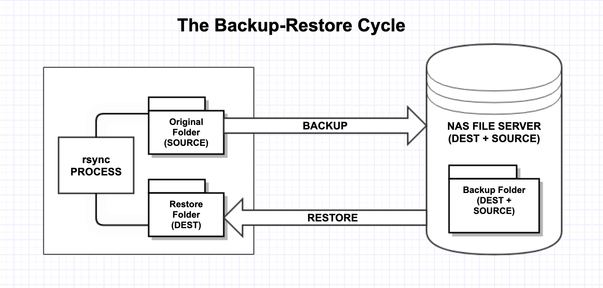

## Use rsync on macOS Without Losing Data

Backups are typically done using Network Attached Storage (NAS) devices. There are numerous file systems in use to support that, but if you're using one of the jumbo storage units, your choices may be limited. But even if the manufacturer offers a multitude of file system options, time and the learning curve may push you toward a familiar option - one you've already invested time and effort in learning. When bringing my new Synology NAS online recently, I learned - again - there are other ***vendor-specific*** factors that may limit your choices. For example, I learned Synology's documentation and technical support are *sorely lacking*; i.e. non-existent. 

Without belaboring that further, I'll just explain the issue, and provide the approach I developed. 

### The issue is *meta-data* - how to avoid losing it:

The issue is best illustrated in a brief example of the backup-restore process depicted below: 



Consider a folder on your macOS local drive - `xyz-original` - for which you want to create a backup using `rsync`.  Before initiating the backup, let's do a recursive listing of the contents of `xyz-original` : 

```zsh
# From my macOS Terminal.app:
% ls -lR xyz-original 
total 16
-rw-r--r--@ 1 seamus  staff   28 Jun 15 01:51 README1
-rw-r-----  1 seamus  staff   30 Jun 20 14:50 ReadMe2
lrwxr-xr-x  1 seamus  staff   26 Jun 20 15:22 f1f2 -> ./folder1/folder1-file2.sh
drwxr-xr-x  4 seamus  staff  128 Jun 20 15:10 folder1

xyz-original/folder1:
total 0
-rw-------  1 seamus  staff  0 Jun 20 15:09 folder1-file1.txt
-rwxr-x---  1 seamus  staff  0 Jun 20 15:10 folder1-file2.sh
# i.e. 2 files, a symlink and a subfolder with two more files; a variety of permissions
```

Note the user & group ownership (*seamus, staff*), the modes/permissions (*r, w, x*), and the time-stamps (*by default* `ls -l` provides the *file modification time*) for each file, folder and link. These parameters are collectively referred to as *meta-data*. When using `rsync` as a backup solution, you might expect that all meta-data would be recovered if and when your backup is restored. But that does not happen automatically, or by default - as shown below. 

In this example, the folder `xyz-original` is backed up to a NAS drive (*my Synology `DS1621+` in this example*) in folder `xyz-backup`. This folder will then be *restored* to another local folder named `xyz-restored`; the restoration will also be done using `rsync`. 

Let's first make this backup, and then the restoration; we will see what happens when we use the oft-recommended `-a` (archive) option with `rsync`. We will add the options `-v` & `-i` to get a verbose, itemized output listing of the operations. 

Recall that the *syntax* of an `rsync` operation is: 

##### `rsync [options] Source Destination`

```zsh
# make a back up of `xyz-original` to the Synology NAS:
% rsync -avi ~/xyz-original/ /System/Volumes/Data/mnt/synology/syn_backup/xyz-backup          
sending incremental file list
.d..tp.g.... ./
>f++++++++++ README1
>f++++++++++ ReadMe2
cL++++++++++ f1f2 -> ./folder1/folder1-file2.sh
cd++++++++++ folder1/
>f++++++++++ folder1/folder1-file1.txt
>f++++++++++ folder1/folder1-file2.sh

sent 506 bytes  received 110 bytes  1,232.00 bytes/sec
total size is 84  speedup is 0.14
```

The *backup* operation is now complete, and `rsync` has copied the folder `xyz-original` from the local drive to the NAS, and placed it in a folder named `xyz-backup`. The next step is to *restore* the backup copy to the local drive. If this were an actual restoration-from-backup, the local drive would likely be empty; in this case, we *restore* to another folder we have named `xyz-restored` so that we can compare `xyz-restored` against `xyz-original`. 

```zsh
# restore 'xyz-backup' from the Synology NAS to local folder 'xyz-restored' for comparison: 
% rsync -avi /System/Volumes/Data/mnt/synology/syn_backup/xyz-backup/ ~/xyz-restored 
sending incremental file list
.d..tp...... ./
>f++++++++++ README1
>f++++++++++ ReadMe2
cL++++++++++ f1f2 -> ./folder1/folder1-file2.sh
cd++++++++++ folder1/
>f++++++++++ folder1/folder1-file1.txt
>f++++++++++ folder1/folder1-file2.sh

sent 454 bytes  received 110 bytes  1,128.00 bytes/sec
total size is 84  speedup is 0.15
```

Compare the `xyz-restored` folder to the `xyz-original` folder, first using the `ls -lR` command : 

```zsh
# compare 'xyz-original' (above) to 'xyz-restored' (below):
% ls -lR xyz-restored
total 16
-rwx------  1 seamus  staff   28 Jun 15 01:51 README1
-rwx------  1 seamus  staff   30 Jun 20 14:50 ReadMe2
lrwx------  1 seamus  staff   26 Jun 20 15:22 f1f2 -> ./folder1/folder1-file2.sh
drwx------  4 seamus  staff  128 Jun 20 15:10 folder1

xyz-restored/folder1:
total 0
-rwx------  1 seamus  staff  0 Jun 20 15:09 folder1-file1.txt
-rwx------  1 seamus  staff  0 Jun 20 15:10 folder1-file2.sh
```

The `xyz-restored` files are all here of course, but the meta-data (*permissions/mode*) is ***clearly different from the `ls -lR xyz-original` result*** shown above. The ***astute reader will also note*** that in addition to the obvious differences, the file ***`README1` has been stripped of all of its*** ***extended attributes!*** We know this from inspection because in the `ls -lR` listing of `xyz-restored`, the `README1` file is missing ***the `@` symbol*** following the mode/permissions. ***Both issues*** are resolved in the sequel; a discussion of the details will be deferred until after a resolution is presented.   

### Avoiding metadata loss in `rsync` backup-restore cycle: 

Using the `rsync` options shown below eliminates the loss of meta-data - including no loss of the macOS *extended attributes*:

```zsh
# repeat the previous backup-restore cycle with a NEW SET OF OPTIONS:
# the backup:
% rsync -rlAXtgoDiv --fake-super ~/xyz-original/ /System/Volumes/Data/mnt/synology/syn_backup/xyz-backup 
# ... output controlled by options `i` and `v`

# the restore:
% rsync -rlAXtgoDiv --fake-super /System/Volumes/Data/mnt/synology/syn_backup/xyz-backup/ ~/xyz-restored 
# ...
```

### Verifying the results: 

All well and good to claim success, but this recipe would be incomplete without some suggestions on how to verify these claims. To this end, [the `src` folder](https://github.com/seamusdemora/seamusdemora.github.io/tree/master/src) folder in this repo contains two scripts that verify the results - after all, I'm now depending upon the accuracy of this recipe for my own backups :) 

The scripts are named [`get-stats.sh`](https://github.com/seamusdemora/seamusdemora.github.io/blob/master/src/get-stats.sh), and [`get-xattrs.sh`](https://github.com/seamusdemora/seamusdemora.github.io/blob/master/src/get-xattrs.sh); they are simple and structurally identical. One uses the `stat` tool to read the *conventional* file stats/metadata; the other uses the macOS tool `xattr`. After logging the `stat` or `xattr` output, results are compared using `diff`. Please feel free to inspect, use or modify these scripts to suit your needs; any feedback via the [Issues page](https://github.com/seamusdemora/seamusdemora.github.io/issues), or suggested improvements via [pull request](https://github.com/seamusdemora/seamusdemora.github.io/pulls) are most welcome. 

And just for the record, following are the verification results comparing `xyz-original` against `xyz-restored`: 

```zsh
# compare the `stat` results to reveal any differences in metadata between `xyz-original` and `xyz-restored`:
% ./get-stats.sh
Files xyz-original-stat.txt and xyz-restored-stat.txt are identical 
% ./get-xattrs.sh 
Files xyz-original-xattr.txt and xyz-restored-xattr.txt are identical
```

Most of the command-line tools I use on macOS are obtained through [MacPorts](https://www.macports.org/), including `rsync` (ver 3.2.4 protocol version 31), `stat` (GNU coreutils ver 9.1), `find` (GNU findutils ver 4.9.0). macOS tools include `ls` (ver May, 2002), and `xattr` (Nov, 2010). 

Whether or not the Apple-supplied tools will work is an open question. The macOS Catalina used in this recipe has `rsync` `version 2.6.9 protocol version 29`; it does not offer all the options used in this recipe. I suspect it will not work properly, but I have not tried it. 

### Some details, ICYI

Some readers may wonder (I certainly did) why all of this is necessary to retain the metadata associated with a file or folder - the owner, group, permissions, time stamps, etc. The short answer is, *"Because the file metadata is not stored within the file itself!"* 

This came as a surprise to me initially because having worked with media files (sound, images, video), I knew that media files contained metadata unique to that file; this metadata could be viewed and edited with the proper tools. Eventually, I came to understand that file metadata can exist both within the data container we call a file, and external to the file. The metadata that exists within the file itself will always be inside the file container - wherever it goes. Consequently, not much thought needs to be given to the internal metadata. It is the external metadata that requires the efforts described here. 

When files are moved cross *file system boundaries* (e.g. APFS-to-ext4, or ext4-to-btrfs), keeping up with the metadata may become a challenge. Most *Unix-like* file systems share the *concept* of an [`inode`](https://en.wikipedia.org/wiki/Inode) - a data structure used to store disk location and attributes (meta-data) of files. APFS utilizes `inodes`, but it's a proprietary filesystem, so it's not known how these data structures are allocated, what data they contain, and the function of that data. 

Apple has used extended attributes (`xattr`) for some time, and they seem to use them extensively now. Without knowledge of the proprietary details, [we can only guess](https://apple.stackexchange.com/questions/200413/what-does-these-extended-attributes-mean-and-where-are-they-documented) at how macOS uses these `xattr`, but it's a certainty that loss of this data may create issues or malfunctions. I'm not keen on the idea that Apple creates and uses all of this meta-data on our systems with no explanation, but given that we're required to go [*all-in*](https://idioms.thefreedictionary.com/all+in) on a proprietary system, it seems a more prudent course to make an effort to retain this data.

Finally, one may wonder, "If the filesystem is proprietary, how does `rsync` manage to preserve it?" I don't know the answer to that question now. I'm interested in the answer though, so check back later.

### `rsync` options and decoding the itemized output

#### A brief summary explanation of each of the `rsync` options used:

```
#  -r	          recursive; recurse into directories
#  -l	          copy symlinks as symlinks
#  --acls, -A     preserve ACLs (implies --perms, -p)
#  --xattrs, -X   preserve extended attributes
#  -t	          preserve modification times
#  -g	          preserve group
#  -o	          preserve owner
#  -D	          preserve devices and special files
#  -v	          increased verbosity; may be repeated
#  -i	          itemize changes
#  --fake-super	store/recover privileged attrs using xattrs (for ACLs & XATTRs)
```

#### Decoding the itemize output (option `i`):

```
# decode --itemize output:
#
# YXcstpoguax  path/to/file
# |||||||||||
# `----------- the type of update being done::
#  ||||||||||   < : file is being transferred to the remote host (sent).
#  ||||||||||   > : file is being transferred to the local host (received).
#  ||||||||||   c: local change/creation for the item, such as:
#  ||||||||||      - the creation of a directory
#  ||||||||||      - the changing of a symlink,
#  ||||||||||      - etc.
#  ||||||||||   h: the item is a hard link to another item (requires --hard-links).
#  ||||||||||   .: the item is not being updated (though it might have attributes that are being modified).
#  ||||||||||   *: means that the rest of the itemized-output area contains a message (e.g. "deleting").
#  ||||||||||
#  `---------- the file type:
#   |||||||||   f for a file,
#   |||||||||   d for a directory,
#   |||||||||   L for a symlink,
#   |||||||||   D for a device,
#   |||||||||   S for a special file (e.g. named sockets and fifos).
#   |||||||||
#   `--------- c: different checksum (for regular files)
#    ||||||||     changed value (for symlink, device, and special file)
#    `-------- s: Size is different
#     `------- t: Modification time is different; T: time set to transfer time
#      `------ p: Permission are different
#       `----- o: Owner is different
#        `---- g: Group is different
#         `--- x: The extended attribute information is being changed.
#          `-- a: The ACL information changed
```


---

### REFERENCES:

1. [Rsync between Mac and Linux](https://odd.blog/2020/10/06/rsync-between-mac-and-linux/); a few words re `--iconv` - the `rsync` character set conversion option 
2. [Why add a trailing slash after an rsync destination?](https://unix.stackexchange.com/questions/402555/why-add-a-trailing-slash-after-an-rsync-destination) ; a trailing `/` plays an important role for src & dest 
3. [Q&A: Where is ACL data technically stored?](https://unix.stackexchange.com/questions/93508/where-is-acl-data-technically-stored); Access Control Lists are also metadata. 
4. [Q&A: Where are extended attributes stored?](https://stackoverflow.com/questions/20618492/where-are-extended-attributes-stored) 
5. [Q&A: Using rsync to backup](https://apple.stackexchange.com/a/444906/149366) 


